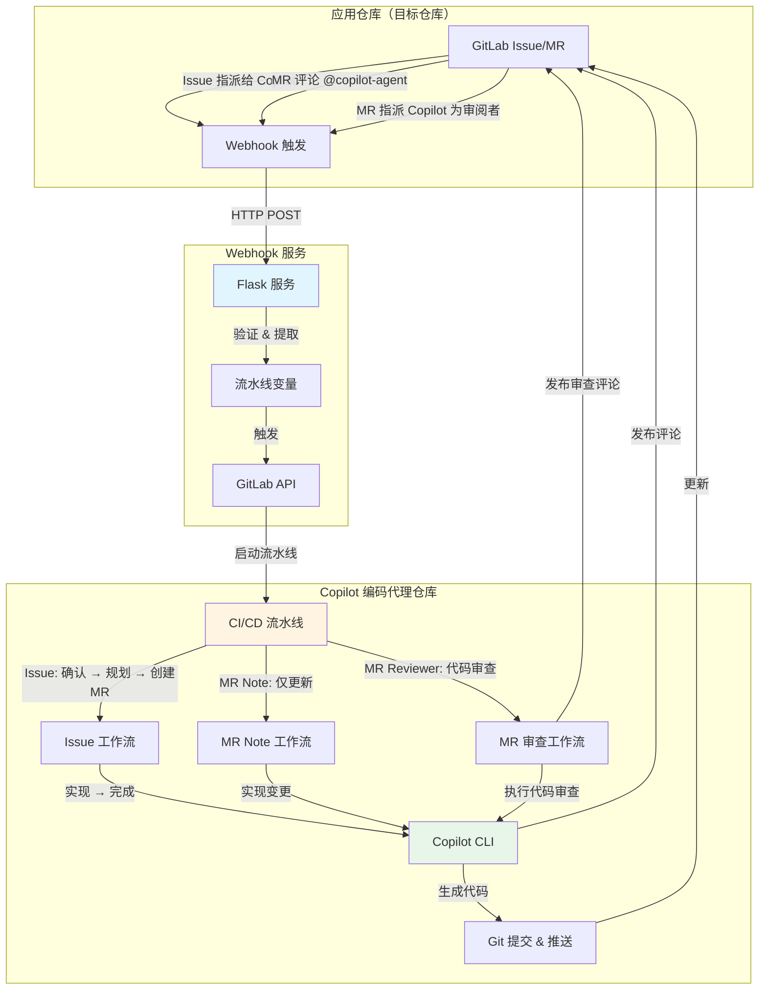
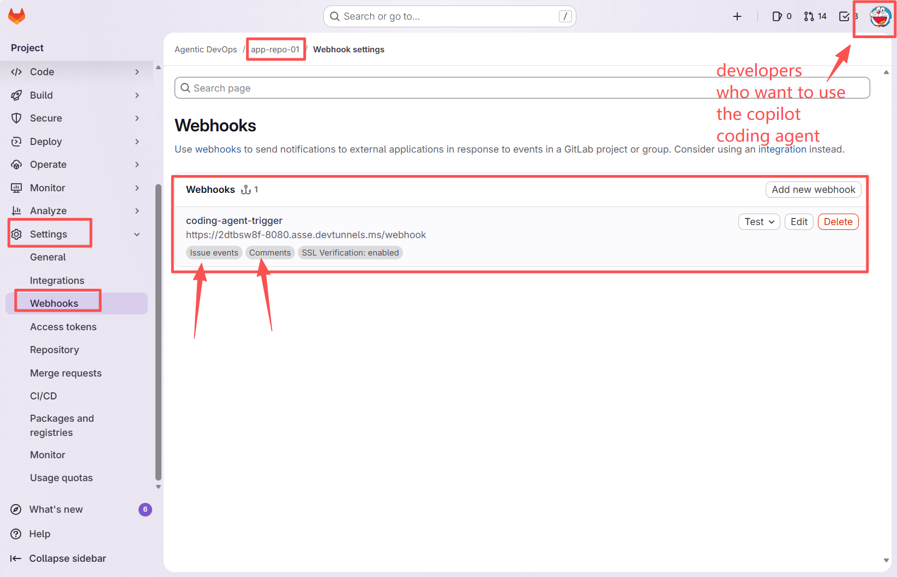

# GitLab Copilot 编码代理

[](https://gitlab.com)
[](https://github.com/features/copilot)
[](LICENSE)

[English](./docs/README_EN.md) | 中文 | [日本語](./docs/README_JA.md) | [हिन्दी](./docs/README_HI.md) | [한국어](./docs/README_KO.md) | [ภาษาไทย](./docs/README_TH.md)

一个由 GitHub Copilot CLI 和 GitLab CI/CD 驱动的全自动编码代理。该系统通过 Issue 指派、合并请求评论和审阅者指派，实现自主代码实现和智能代码审查。

在原来上游的实现上加入了多阶段的执行与项目理解跟进，在大型项目里的工作任务可以更加准确。 可以参考文档 [TECHNICAL_ARCHITECTURE](./docs/TECHNICAL_ARCHITECTURE.md) 及 [WORKFLOW_ARCHITECTURE](WORKFLOW_ARCHITECTURE.md)

## ✨ 核心特性（多代理分支）

此分支 (`multi-agents`) 引入了高级功能：

| 特性 | 描述 |
|------|------|
| 🔄 **多阶段编排** | 9阶段工作流：确认 → 克隆 → 上下文 → 规划 → MR → 执行 → 提交 → 上传 → 完成 |
| 🧠 **智能任务规划** | 自动将复杂 Issue 分解为子任务，支持依赖分析 |
| 💾 **Git风格上下文缓存** | 内容寻址存储（CAS）用于项目理解，支持5级回退策略 |
| 🔀 **跨分支去重** | 当 commit 匹配时，跨分支复用缓存上下文 |


## 演示与示例
**YouTube 演示视频**

安装设置:  
- [GitLab Copilot 编码代理 - 安装指南](https://www.youtube.com/watch?v=aSQVP1AAD60)

使用方法:  
- [GitLab Copilot 编码代理 - 使用方法 2:30 – 在应用仓库中创建 Issue 并指派给 Copilot](https://www.youtube.com/watch?v=med7Bfff_m4&t=150s)
- [GitLab Copilot 编码代理 - 使用方法 11:24 – 通过评论让 Copilot 在合并请求中进行更新](https://www.youtube.com/watch?v=med7Bfff_m4&t=684s)

**示例仓库**
- 公开 GitLab 演示仓库 [一个示例应用仓库](https://gitlab.com/gh-copilot1/okr)
- Issue: [Copilot 处理 Issue ](https://gitlab.com/gh-copilot1/okr/-/issues/10)
- MR: [Copilot 将处理 Issue 的代码创建新的 MR](https://gitlab.com/gh-copilot1/okr/-/merge_requests/31)
- 代码审查: [将 Copilot 指派为 MR 审阅者](https://gitlab.com/gh-copilot1/okr/-/merge_requests/31#note_2962392021)
- 通过评论更新 MR: [@Copilot 接收 Review 意见代码](https://gitlab.com/gh-copilot1/okr/-/merge_requests/31#note_2962434908)

## 🏗️ 架构



### 系统组件

1. **应用仓库**: 您的应用代码仓库，是开发工作进行的地方
2. **Webhook 服务**: 基于 Flask 的中继服务，用于捕获 GitLab 事件
3. **Copilot 编码代理仓库**: 运行编码自动化的 CI/CD 编排器

### 工作流概览

**Issue 指派工作流**（完全自动化）:
```
Issue 指派给 Copilot → Webhook → 触发流水线 → 
确认 Issue → 生成 TODO 计划 → 创建 MR → 
实现代码 → 推送变更 → 更新 MR 和 Issue
```

**MR Note 工作流**（快速更新）:
```
在 MR 中评论 @copilot-agent → Webhook → 触发流水线 →
确认 → 实现变更 → 推送到源分支 →
发布摘要评论
```

**MR 审阅者工作流**（智能代码审查）:
```
将 Copilot 指派为 MR 审阅者 → Webhook → 触发流水线 →
确认 → 分析代码变更 → 执行全面审查 →
发布详细审查评论
```

## 📋 前置要求

### 必需工具
- 具有 API 访问权限的 **GitLab 账户**
- **GitLab Runner（Docker/Kubernetes 执行器）**（用于 CI/CD 执行）
- **GitHub Copilot CLI** 访问权限和订阅
- **Docker**（可选，用于容器化运行 webhook 服务）

### 必需权限
- **应用仓库**: Maintainer 角色（用于接收 webhooks 和创建 MRs）
- **Copilot 编码代理仓库**: Owner 角色（用于配置 CI/CD）
- 具有以下作用域的 **GitLab 个人访问令牌**:
  - `api`（完整 API 访问）
  - `read_repository`
  - `write_repository`

## 🚀 管理员安装指南

### 步骤 1: 创建 Copilot 机器人用户（可选但推荐）
> 建议为 Copilot 代理创建专用的 GitLab 用户账户，以便更好地进行权限管理和活动审计。您可以使用现有账户，但不推荐。

1. 创建一个名为 "Copilot" 或类似名称的新 GitLab 账户
2. 为此账户生成个人访问令牌:
   - 前往 **用户设置** → **个人访问令牌**
   - 令牌名称: `copilot-automation`
   - 作用域: 选择所有作用域（或至少: `api`、`read_repository`、`write_repository`）
   - 安全保存令牌
   
   
3. 为此用户授予适当权限（选择一种方式）:
   - **方案 A（推荐用于组织范围）**: 设置为 GitLab **管理员** 或 Group **Owner**
     - 这允许 Copilot 用户访问 GitLab 实例或组中的所有仓库
     - 更便于管理多个项目
   - **方案 B（推荐用于有限范围）**: 添加为特定应用仓库的成员
     - 角色: **Developer** 或 **Maintainer**
     - 更精细的控制，适合您偏好受限访问的情况
   - 此用户将被指派到 issues 并创建合并请求

### 步骤 2: 设置 Copilot 编码代理仓库
> 使用 Copilot 用户进行操作

1. **通过 Git URL 将此仓库导入您的 GitLab**
   - 使用步骤 1 中创建的 Copilot 用户作为仓库所有者，然后导入仓库到 GitLab:
     ```bash
     https://github.com/satomic/gitlab-copilot-coding-agent.git
     ```
      
      
      
   - 新导入的仓库可见性应设置为 Internal
      

2. **配置 CI/CD 变量**
   
   前往 **设置** → **CI/CD** → **变量**，添加以下内容:

   | 变量 | 描述 | Protected | Masked |
   |------|------|-----------|--------|
   | `GITLAB_TOKEN` | 个人访问令牌（来自步骤 1） | ✅ | ✅ |
   | `GITHUB_TOKEN` | GitHub Copilot CLI 访问令牌，需包含有效的 GitHub Copilot 订阅 | ✅ | ✅ |

   生成 `GITHUB_TOKEN`（需要启用 "Copilot Requests" 权限的细粒度 PAT）:
   - 访问 https://github.com/settings/personal-access-tokens/new
   - 在 "Permissions" 下，点击 "add permissions" 并选择 "Copilot Requests"
   - 生成您的令牌
   


   

   记得将可以使用流水线变量的角色更改为 Developer
   

3. **设置 GitLab Runner**
   > 如果您的 GitLab 实例已有可用的 Docker/Kubernetes 执行器 Runners，可以跳过此步骤。

   确保您有一个配置了以下内容的 GitLab Runner:
   - Docker 执行器（推荐）
   - 可访问 Docker 镜像: `satomic/copilot-cli:latest`

   如果使用标签，确保 Runner 有相应的标签，或根据需要更新 `.gitlab-ci.yml`。新 Runner 注册可以按照 GitLab 页面指导完成，可以在项目或组级别注册。以下是项目级别的示例:
   

4. **配置 Copilot CLI 访问**
   
   我已构建了 Docker 镜像 `satomic/copilot-cli:latest`，其中包括:
   - 已安装 GitHub Copilot CLI
   - 预配置认证，读取 `GITHUB_TOKEN` 环境变量
   
   或者构建您自己的带有 Copilot CLI 访问权限的镜像。

### 步骤 3: 部署 Webhook 服务

1. **创建 `.env` 文件**
   ```bash
   cat > .env << EOF
   PIPELINE_TRIGGER_TOKEN=your-trigger-token, 在步骤 2 创建的仓库的 Settings → CI/CD → Pipeline trigger tokens 中生成
   PIPELINE_PROJECT_ID=your-project-id, 此仓库的项目 ID（在 Settings → General 中找到）
   PIPELINE_REF=main
   GITLAB_API_BASE=https://gitlab.com # 如果是私有部署实例请更改
   WEBHOOK_SECRET_TOKEN=
   COPILOT_AGENT_USERNAME=copilot-agent # Copilot 机器人的 GitLab ID
   COPILOT_AGENT_COMMIT_EMAIL=copilot@github.com # git 提交使用的邮箱
   LISTEN_HOST=0.0.0.0
   LISTEN_PORT=8080
   ENABLE_INLINE_REVIEW_COMMENTS=true
   COPILOT_LANGUAGE=zh
   EOF
   ```

   - `PIPELINE_TRIGGER_TOKEN`: 在步骤 2 创建的仓库的 **设置** → **CI/CD** → **Pipeline trigger tokens** 中生成
   
   - `PIPELINE_PROJECT_ID`: 此仓库的项目 ID（在 **设置** → **通用** 中找到）
   
   - `COPILOT_AGENT_USERNAME`: 步骤 1 中创建的 Copilot 机器人用户的 GitLab ID
   

2. **使用 Docker 运行**
   ```bash
   docker run -itd \
     --name gitlab-copilot-coding-agent-hook \
     -p 8080:8080 \
     --env-file .env \
     --restart unless-stopped \
     satomic/gitlab-copilot-coding-agent-hook:latest
   ```
3. **从源码运行（可选）**
   ```bash
   git clone https://github.com/satomic/gitlab-copilot-coding-agent.git
   cd gitlab-copilot-coding-agent/
   python3 main.py
   ```
4. **Hook URL**
   获取 webhook 服务的公网 URL，例如:
   - `http://your-server-ip:8080/webhook`

### 步骤 4: 在应用仓库中配置 Webhooks
> 通常，想要使用 Copilot 编码代理的开发者只需要在自己的应用仓库中配置 webhook，无需访问 Copilot 编码代理仓库。

1. 前往您的 **应用仓库** → **设置** → **Webhooks**

2. **创建 Webhook**
   - URL: `http://your-server-ip:8080/webhook`
   - Secret Token:（与 `WEBHOOK_SECRET_TOKEN` 相同）
   - 触发器: ✅ **Issues events**、✅ **Comments**（note events）和 ✅ **Merge request events**
   - 点击 **Add webhook**
   

3. **测试 webhook**
   - 点击 **Test** → **Issue events**
   - 检查 webhook 服务日志确认成功接收
   - 验证 HTTP 200/202 响应

### 步骤 5: 验证

1. **测试 Issue 指派**
   - 在应用仓库中创建一个测试 issue
   - 将其指派给 Copilot 用户
   
   - 观察 Copilot 编码代理仓库中触发的 CI/CD 流水线
   
   - 验证 MR 创建和代码实现
   
   

2. **测试 MR Note**
   - 在应用仓库中创建一个测试 MR
   - 评论: `@copilot-agent 添加一个 hello world 函数`
   
   - 验证流水线执行和代码变更
   

3. **测试 MR 审阅者**
   - 在应用仓库中创建或打开一个测试 MR，将 Copilot 用户指派为审阅者
   
   - 验证流水线执行和审查评论发布，检查 Copilot 发布的详细代码审查报告
   

4. **检查日志**
   ```bash
   # Webhook 服务日志
   docker logs -f gitlab-copilot-coding-agent-hook
   
   # 检查保存的 webhook 载荷
   ls -la hooks/
   
   # 检查流水线日志
   # 前往 Copilot 编码代理仓库 → CI/CD → Pipelines
   ```

## 📖 用户指南

### 开发者: 使用 Issue 指派

1. **在应用仓库中创建 Issue**
   ```markdown
   ## 需求
   - 实现用户认证
   - 添加密码哈希
   - 创建登录端点
   - 添加 JWT 令牌生成
   ```

2. **指派给 Copilot**
   - 在 issue 页面，将其指派给 "Copilot" 用户
   - 系统将自动开始工作

3. **跟踪进度**
   - Copilot 发布带有流水线链接的确认评论
   - 创建带有 TODO 清单的合并请求
   - 代码自动实现
   - 最终评论通知完成

   > **注意**: 如果该 issue 已存在合并请求，Copilot 会检测到并在 issue 中发布通知，请求您在现有 MR 中继续工作而不是创建重复的。

4. **审查 & 合并**
   - 在 MR 中审查生成的代码
   - 如需变更请提出（见下方 MR Note 用法）
   - 满意后批准并合并

### 开发者: 使用 MR Note 命令

1. **在现有 MR 中**，添加评论:
   ```
   @copilot-agent 为登录函数添加错误处理
   ```

2. **支持的指令**
   - 添加功能: `@copilot-agent 为认证添加单元测试`
   - 修复 bug: `@copilot-agent 修复第 45 行的空指针异常`
   - 重构: `@copilot-agent 重构用户服务以使用依赖注入`
   - 更新: `@copilot-agent 将依赖更新到最新版本`

3. **Copilot 将会**:
   - 确认您的请求
   - 实现变更
   - 提交并推送到 MR 分支
   - 发布变更摘要

### 开发者: 使用 MR 审阅者进行代码审查

1. **在 MR 页面**，将 Copilot 用户指派为审阅者
   - 在 MR 页面右侧找到 "Reviewers" 选项
   - 选择 Copilot 用户（例如 copilot-agent）

2. **Copilot 将会**:
   - 自动触发代码审查工作流
   - 分析源分支和目标分支之间的所有代码变更
   - 执行全面的代码审查，包括:
     - 代码质量和可维护性
     - 最佳实践和设计模式
     - 安全漏洞检查
     - 性能分析
     - 测试覆盖率评估
     - 文档完整性
   - 在 MR 中发布按严重程度分类的详细审查报告
   - 提供具体的改进建议和推荐修复方案

3. **审查报告内容**:
   - 总体评估摘要
   - 按严重程度分类的问题（严重、主要、次要、建议）
   - 每个问题包括文件位置、详细描述和修复建议
   - 最终审查建议: APPROVE（批准）、REQUEST_CHANGES（请求变更）或 NEEDS_DISCUSSION（需要讨论）

### 最佳实践

**编写有效的 Issue 描述**:
- 具体说明需求
- 包含验收标准
- 提供上下文和示例
- 使用清单列出多个任务

**使用 MR Note 命令**:
- 每条评论一个清晰的指令
- 尽可能引用具体的文件/函数
- 简洁但描述清楚
- 等待完成后再发下一条指令

**代码审查**:
- 始终审查生成的代码
- 测试实现
- 检查安全问题
- 验证编码规范合规性

## 🔧 配置参考

### 中间文件（自动从 Git 排除）

以下文件在执行过程中生成但从提交中排除:
- `patch_raw.txt` - 原始 Copilot 输出
- `todo.md` / `todo_completed.md` - 任务清单
- `plan.json` - 执行计划
- `commit_msg.txt` - 生成的提交消息
- `mr_summary.txt` - 变更摘要

## 🐛 故障排除

### Webhook 未触发

1. **检查 webhook 投递**
   - 应用仓库 → 设置 → Webhooks → 查看最近投递
   - 查找 2xx 状态码

2. **验证 webhook 服务**
   ```bash
   curl -X POST https://webhook.yourdomain.com/webhook \
     -H "Content-Type: application/json" \
     -d '{"test": true}'
   ```

### 流水线未启动

1. **检查触发令牌**
   - 确认 `PIPELINE_TRIGGER_TOKEN` 有效
   - 验证 `PIPELINE_PROJECT_ID` 正确

2. **检查 Runner 可用性**
   - 确认有可用的 Runner
   - 检查 Runner 标签是否匹配

### Copilot CLI 错误

1. **检查 GitHub Token**
   - 确认 `GITHUB_TOKEN` 有效
   - 验证 Copilot 订阅状态

2. **检查 Runner 镜像**


## 📄 许可证

MIT License - 详见 [LICENSE](LICENSE) 文件
